# Online Book Store

## Project Overview
This is a web-based Online Book Store application developed as a group project for the Rapid Application Development subject. The application allows users to browse, search, and purchase books online while also providing administrative features for managing the book inventory and orders.

## Technologies Used
- **Java JSP (JavaServer Pages)**
- **JDK 1.8**
- **GlassFish Server 4.1.1**
- **MySQL Database**
- **JDBC 5.1.23**
- **HTML/CSS/JavaScript**

## Features

### User Features
1. **User Authentication**
   - User registration
   - User login
   - Password update
   - Profile management

2. **Book Browsing and Shopping**
   - View all available books
   - Search books by various criteria
   - Filter books by categories/authors
   - View detailed book information
   - Add books to orders

3. **Order Management**
   - Place new orders
   - View order history
   - Track order status

4. **User Profile**
   - View and update personal information
   - Change password
   - View order history

### Admin Features
1. **Book Management**
   - Add new books to inventory (`addBook.jsp`)
   - Update existing book details (`updateBook.jsp`)
   - Delete books from inventory (`deleteBook.jsp`)
   - View all books in the system (`all_books.jsp`)

2. **Order Management**
   - View all orders (`orders.jsp`, `orders_1.jsp`)
   - Complete pending orders (`completeOrder.jsp`)
   - Delete orders (`deleteOrder.jsp`)

## Screenshots

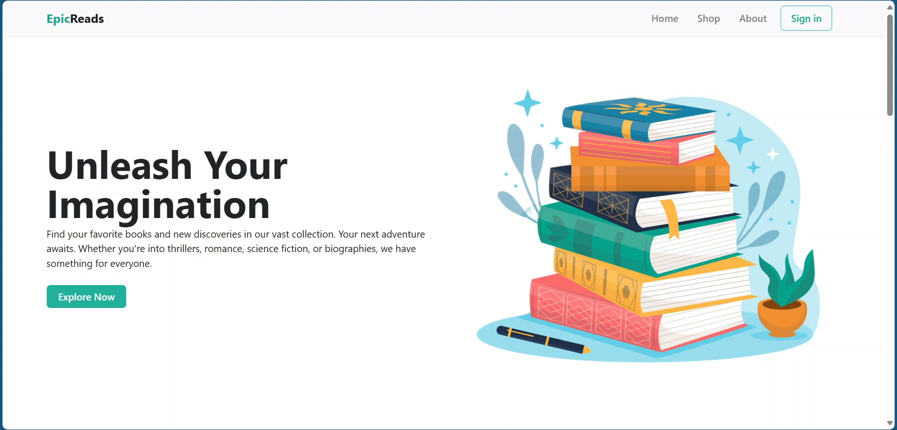
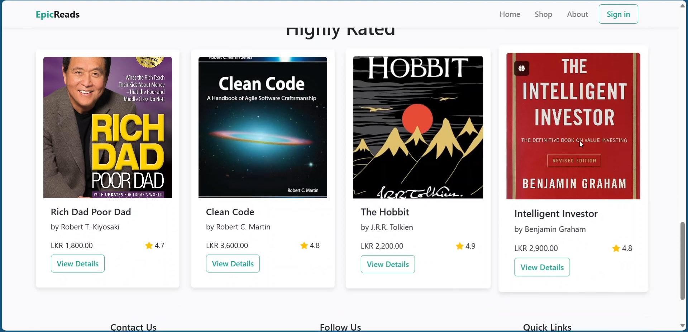
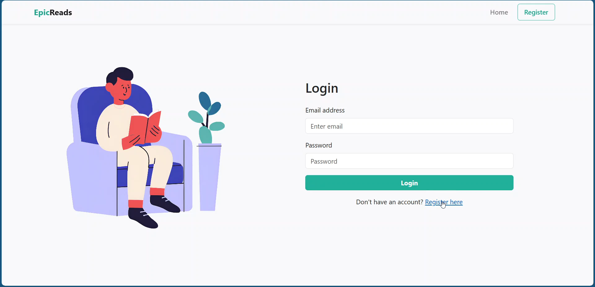
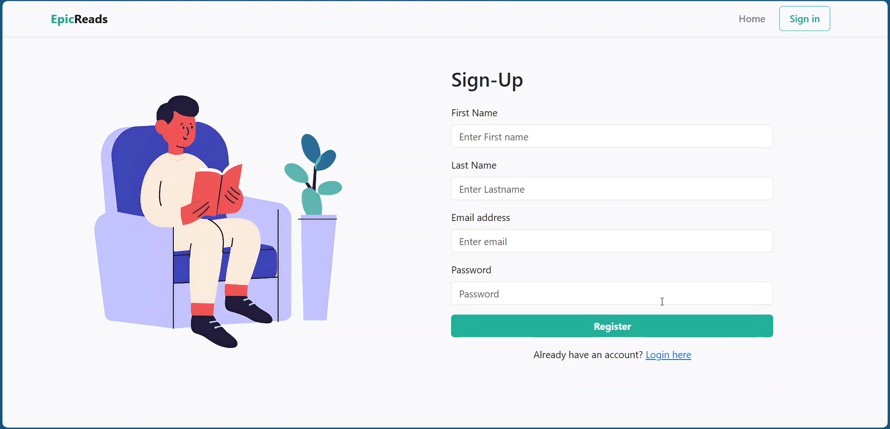
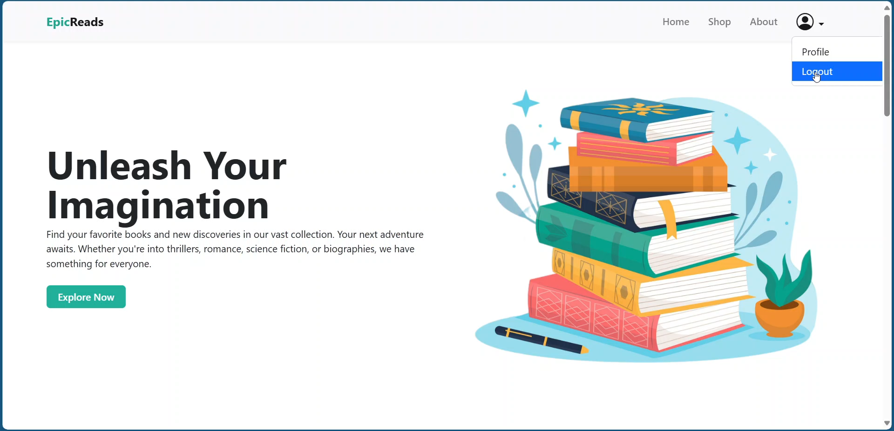
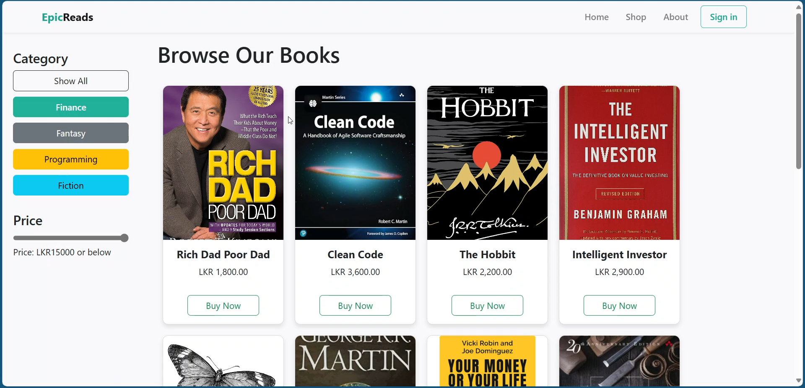
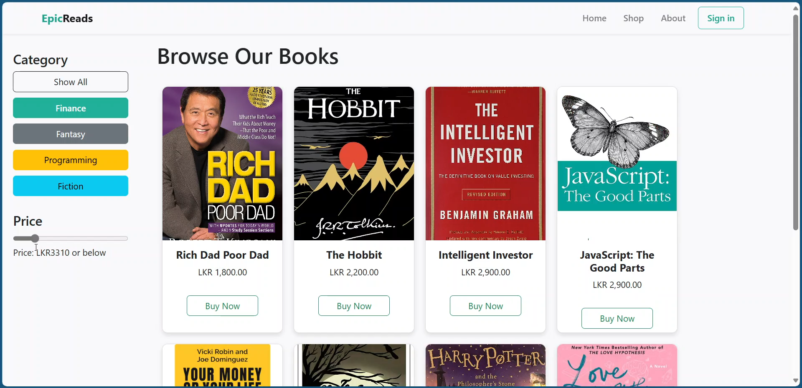
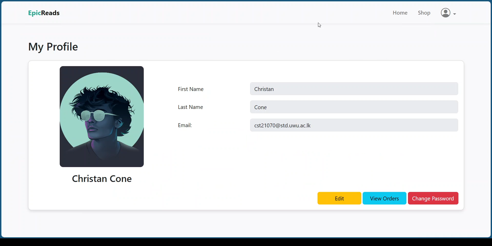
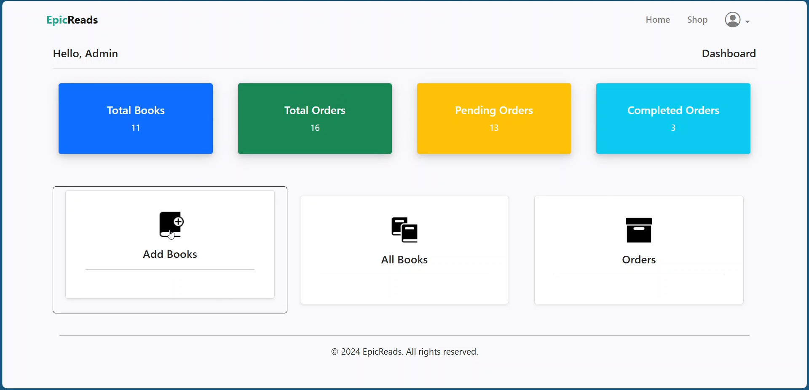
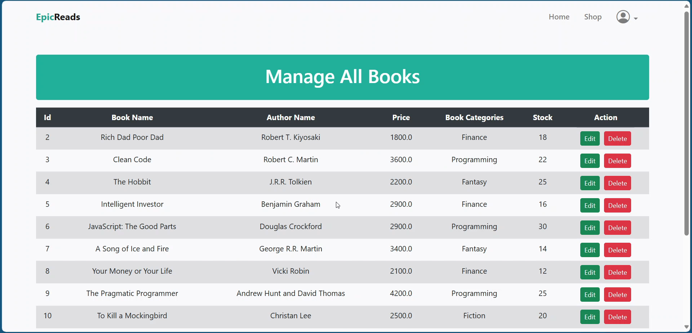
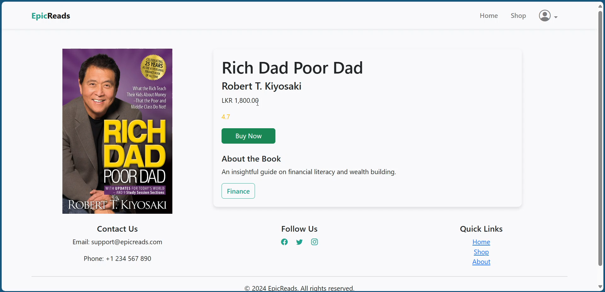

## Project Structure
```
projectRAD/
├── Images                      # Project-level images
├── src
│   ├── conf                    # Configuration files
│   └── java                    # Java source code
│       └── app                 # Application code
├── web
│   ├── admin/                  # Admin panel JSP files
│   ├── images/                 # Website images
│   ├── script/                 # JavaScript files
│   ├── style/                  # CSS stylesheets
│   ├── *.jsp                   # Main JSP pages
│   └── WEB-INF/               # Web application configuration
```

## Setup Instructions

### Prerequisites
1. NetBeans IDE (8.2 or later recommended)
2. JDK 1.8
3. GlassFish Server 4.1.1
4. XAMPP (for MySQL database)
5. MySQL JDBC Driver 5.1.23

### Database Setup
1. **Install and Start XAMPP**:
   - Download and install XAMPP from [https://www.apachefriends.org/](https://www.apachefriends.org/) if you don't have it already
   - Start the XAMPP Control Panel
   - Start the Apache and MySQL services by clicking the "Start" buttons next to them

2. **Create a Database**:
   - Open your web browser and navigate to [http://localhost/phpmyadmin/](http://localhost/phpmyadmin/)
   - Click on "New" in the left sidebar
   - Enter "epicreads" as the database name and select "utf8mb4_general_ci" as the collation
   - Click "Create"

3. **Import the Database**:
   - Select the newly created "epicreads" database from the left sidebar
   - Click on the "Import" tab in the top navigation
   - Click "Browse" (or "Choose File") and locate the `EpicReads.sql` file in your project files
   - Leave the default settings and click "Go" at the bottom of the page
   - Wait for the import to complete (you should see a success message)
   - Verify the import by clicking on the "epicreads" database and checking that all tables were created successfully

### Project Setup in NetBeans
1. **Open Project**
   - Open NetBeans IDE
   - Go to File > Open Project
   - Navigate to the project directory and open it

2. **Configure GlassFish Server**
   - Go to Tools > Servers
   - Add GlassFish Server if not already configured
   - Point to your GlassFish 4.1.1 installation directory

3. **Configure Database Connection**
   - Create a new database connection in NetBeans
   - Configure the connection to use the MySQL JDBC Driver
   - Enter your database credentials:
     - JDBC URL: jdbc:mysql://localhost:3306/epicreads
     - User: root (default XAMPP MySQL username)
     - Password: (leave empty for default XAMPP installation, or enter your custom password if you set one)
   - Test the connection to ensure it works properly

4. **Build and Run**
   - Right-click on the project in the Projects panel
   - Select "Clean and Build"
   - After a successful build, select "Run"
   - NetBeans will deploy the application to GlassFish and open it in your default web browser

### Accessing the Application
- **User Interface**: http://localhost:8080/projectRAD/
- **Admin Interface**: http://localhost:8080/projectRAD/admin/admin.jsp

## User Guide

### For Regular Users
1. Register a new account using the registration page
2. Log in with your credentials
3. Browse books from the main page
4. Use search and filter options to find specific books
5. Click on a book to view its details
6. Add books to your cart and proceed to checkout
7. View your order history and track current orders
8. Update your profile information as needed

### For Administrators
1. Access the admin panel using admin credentials
2. Manage the book inventory (add, update, delete)
3. Process customer orders
4. View and manage all user orders


## License

The Online Book Store project is licensed under the MIT-OBS License (MIT Online Book Store License)
MIT License

Copyright (c) 2025 Mishaf Hasan

Permission is hereby granted, free of charge, to any person obtaining a copy
of this software and associated documentation files (the "Software"), to deal
in the Software without restriction, including without limitation the rights
to use, copy, modify, merge, publish, distribute, sublicense, and/or sell
copies of the Software, and to permit persons to whom the Software is
furnished to do so, subject to the following conditions:

The above copyright notice and this permission notice shall be included in all
copies or substantial portions of the Software.

THE SOFTWARE IS PROVIDED "AS IS", WITHOUT WARRANTY OF ANY KIND, EXPRESS OR
IMPLIED, INCLUDING BUT NOT LIMITED TO THE WARRANTIES OF MERCHANTABILITY,
FITNESS FOR A PARTICULAR PURPOSE AND NONINFRINGEMENT. IN NO EVENT SHALL THE
AUTHORS OR COPYRIGHT HOLDERS BE LIABLE FOR ANY CLAIM, DAMAGES OR OTHER
LIABILITY, WHETHER IN AN ACTION OF CONTRACT, TORT OR OTHERWISE, ARISING FROM,
OUT OF OR IN CONNECTION WITH THE SOFTWARE OR THE USE OR OTHER DEALINGS IN THE
SOFTWARE.

